## Camera list page

When the camera is connected to the computer, 3DViewer will automatically monitor the connectable camera and display the serial number of the camera in the red box as shown in the figure below. If it is a network device, the IP address of the device will be carried behind the serial number. Hover the mouse pointer over the camera list item, and the camera serial number will be highlighted. If the camera is not connected, the "Connect" mark will be displayed on the right side of the serial number; If the camera is connected, a "Disconnect" mark is displayed to the right of the serial number.

- ### Connecting Cameras

  3DViewer only supports connecting a single camera at the same time. Find the camera serial number in the camera list, click the left mouse button, and wait for the camera to connect successfully. If other cameras have been connected before, the connected camera will be disconnected before connecting the new camera. After the connection is successful, the “ ✔” Icon will be displayed in front of the serial number.

- ### Disconnecting the camera

    If you need to disconnect the connected camera, just click the connected camera list item.
    
    
    ## Start/Stop Preview

    ### Launch Preview

    Before starting the preview, you need to connect the camera (see [Connect Camera](#1) for how to connect the camera). After connecting the camera, select the required data format and resolution in the format and resolution settings of parameter settings, and then click the "Start Preview" button at the following icon 2. After starting, you will see the image and point cloud window on the right side of the window.
    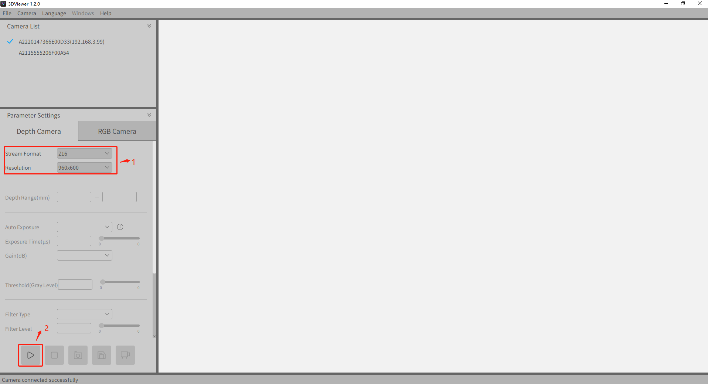
    
    ### Stop Preview

    The stop preview will not take effect until the preview is started. Click the stop preview button marked 2 in the following figure to stop the current preview. The camera will not be disconnected after the preview is stopped. You cannot set camera related parameters, but you can set the data format and resolution size of the depth camera and RGB camera.
    
    ## Pause/Resume Preview

    After starting the preview, you can click the button at the first place of the following icon to enter the suspended preview state, and new data will not be updated in this state; When the preview is paused, click this button again to return to the preview state, and the camera data will be continuously updated.
    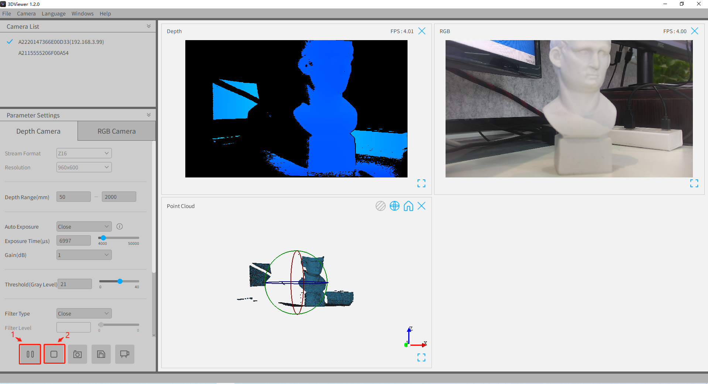
    ## Set camera parameters

    The camera parameter setting page is shown in the red box below. On the left side of the whole window, it is divided into depth camera parameters and RGB camera parameters (if the device does not have an RGB camera, the "RGB Camera" button is displayed in gray and cannot be clicked). On the parameter setting page, you can complete different settings for the camera by adjusting the exposure time, gain, depth range, white balance and other parameters, Then view the image effects under different settings in the image display area on the right.
    ### Depth camera parameters

    Each parameter setting of the depth camera will affect the depth map, IR (infrared) image, point cloud image, but not the RGB image. Each parameter setting is described as follows:
    - **Stream Format**: The depth camera stream formats are divided into Z16, Z16Y8Y8, and Pair. The preview mode cannot switch the stream format, which can only be switched when the stream is stopped or paused;
    - **Resolution**: The size of the Resolution, which determines the image display scale, and together with the stream format, determines the size of a frame of depth data;
    - **Depth Range**: Determines the visual range of the camera. Only objects within the depth range can be captured by the camera;
    - **Auto Exposure**: Auto exposure is turned off by default. After auto exposure is turned on, the exposure time and gain are automatically set by the camera system. 3DViewer cannot manually set the exposure time and gain. There are three modes of deep auto exposure: Speed First, Quality First and Foreground, which have the following characteristics:
      - **Speed First**: This mode has a fast frame rate, and the image quality may deteriorate;
      - **Quality First**: This mode has good image quality, and the frame rate may decrease;
      - **Foreground **: This mode gives priority to adjusting the image quality of near objects, while the image quality of far objects may become worse.
    - **Exposure Time**: when the automatic exposure is on, manually set the exposure time to gray disabled. Adjusting the exposure time will affect the image quality and frame rate;
    - **Gain:** When the automatic exposure is turned on, the gain manually set is disabled in gray. Adjusting the gain will affect the image quality. The greater the gain, the greater the noise, and the gain adjustment will not affect the image frame rate;
    - **Threshold**: An input box or slide bar to the right of the regulated threshold size will allow adjustment of the threshold size, and a larger threshold will mark a point cloud with higher reliability, but a lower number of point clouds；
    - **Filter Type**: There are three filter types: Smooth, Median and Time Domain Smooth. By default, the filter is off. You can select an appropriate filter type from the drop-down box on the right of Filter Type;
    - **Filter Level**: The filter level ranges corresponding to different filter types may be different. The larger the filter level, the greater the degree of filtering, and the more obvious the smoothing effect of the image;
    - **Fill Hole**: filling holes is not enabled by default. You can click the icon button on the right side of Fill Hole. After opening filling holes, some holes in the image will be filled.
    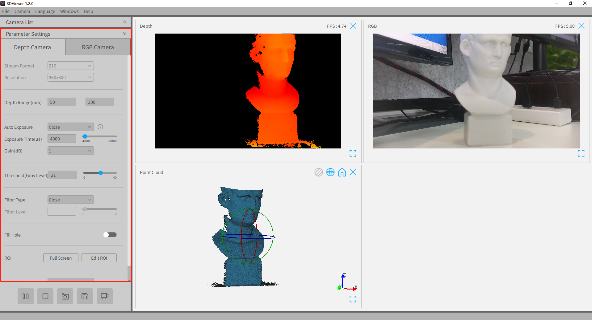
    ### ROI setting

    ROI is effective only when there is a depth map. Adjust the ROI position by using the ROI setting buttons "Full Screen" and "Edit ROI" in the parameter settings as shown in the figure below
    - **Full Screen**: click this button, and the ROI area will be set to (0, 0, 1, 1), that is, the entire area of the depth map, and the ROI box will be displayed on the depth map, as shown in the following figure;
    - **Edit ROI**: click this button to obtain the current ROI value, and then draw the ROI box corresponding to the size and position of the ROI value on the depth map.

| Full Screen                               | Edit ROI                            |
| ----------------------------------------- | ----------------------------------- |
|  |  |
- Adjust the size of ROI box: move the left mouse button to the four corners of the ROI box or the middle of the border, press it, and then move the mouse to adjust the size of the ROI box; Press the left mouse button in the middle of the ROI, and then move the mouse to adjust the ROI position.
- Set ROI: click the“ ✔ "Button.
- Hide ROI box: click "✖" button in the lower right corner of ROI box .
### HDR settings

HDR settings are at the bottom of depth parameter settings, mainly including setting HDR mode, setting HDR level and user-defined settings.
- **Set HDR mode**: HDR mode is divided into Close, Shiny, Dark, Both, and Manual. The default is Close mode, and different HDR modes are switched in the "HDR Mode" drop-down box.
- **Set HDR level**: You can adjust the HDR level by adjusting the input box or slider in "HDR Level". The higher the level setting, the slower the frame rate.
- **Custom settings**: When the HDR mode is set to "Manual", you can manually adjust the exposure time and gain in the table in HDR settings as shown in the figure below, and then click the "OK" button to set multiple groups of exposure time and gain in HDR mode.
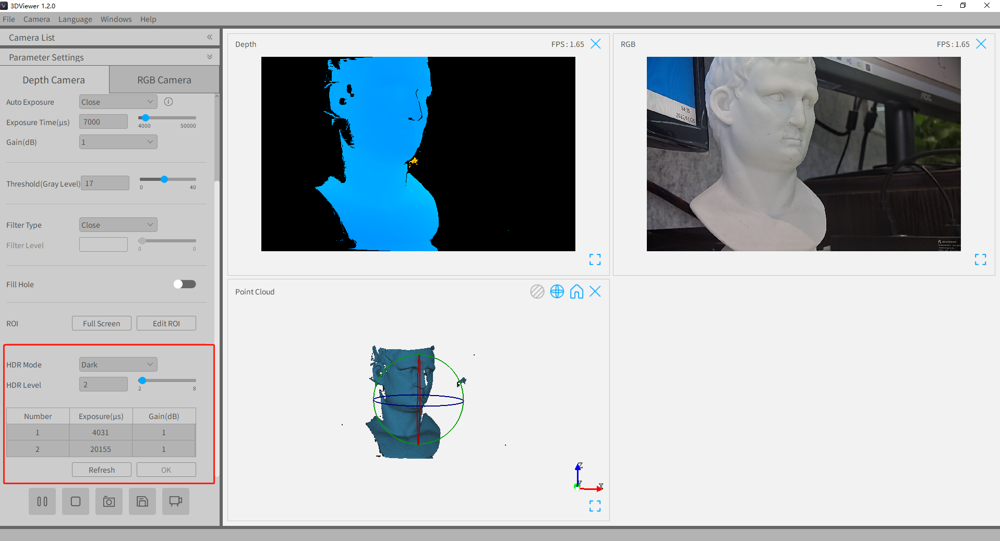
### RGB camera parameters

Each parameter setting of RGB camera only affects RGB image and point cloud mapping, and does not affect the display of other images. Each parameter setting is as follows:
- **Stream Format**: RGB camera stream formats are divided into RGB8 and MJPG. The preview mode cannot switch the stream format. It can only be switched when the stream is stopped or paused;
- **Resolution**: the size of the resolution, which determines the image display scale, and together with the stream format, determines the size of a frame of RGB data;
- **Auto Exposure**: After the auto exposure is turned on, the manual adjustment of exposure time and gain is disabled. The exposure time and gain values are automatically set by the camera system and dynamically change with the environment;
- **Exposure Time**: when the automatic exposure is on, manually set the exposure time to gray disabled. Adjusting the exposure time will affect the image quality and frame rate;
- **Gain**: when the automatic exposure is turned on, the gain manually set is disabled in gray; Adjusting the gain will affect the image quality. The greater the gain, the greater the noise. The gain adjustment will not affect the image frame rate;
- **Auto White Balance**: After the automatic white balance is turned on, the manual setting of white balance is disabled, and the white balance value is automatically set by the camera system, which changes dynamically with the environment;
- **White Balance**: When automatic white balance is on, manually set the white balance to gray disabled; When it is not turned on, you can manually enter the white balance value or adjust the slider to obtain the most ideal and realistic image effect.

## Camera settings

### Restart the camera

As shown in the following figure, click the "Restart camera" menu item in the "Camera" menu, and the camera will restart the system, which will take about 25-45 seconds. Please wait patiently. After the camera restarts, the camera will automatically connect, and you need to manually start the preview to enter the preview mode. (Note that the "Camera" menu is disabled when the camera is not connected.)
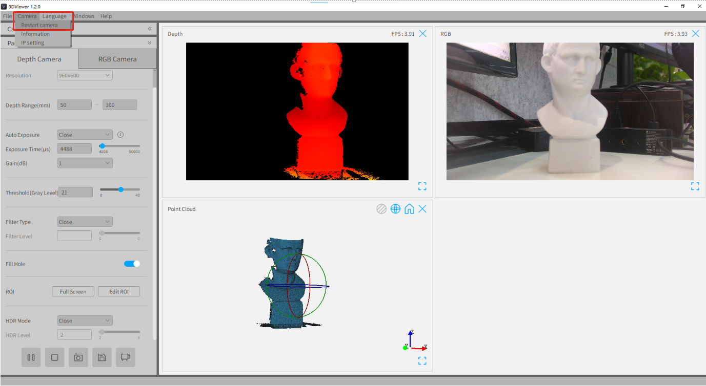
### View camera information

As shown in the following figure, click the "Information" menu item in the "Camera" menu to pop up the "Camera Info" pop-up box, displaying such information as Model, Serial Number, SDK Version, Firmware Version, Algorithm Version, and Connect Mode. The camera information can only be viewed after the camera is connected.

### IP Settings

As shown in the following figure, click the "IP Setting" menu item in the "Camera" menu to pop up the "IP Setting" pop-up box, which is used to modify the Camera IP settings.

- Modify the IP address: The modification of the IP address takes effect only when the camera is in manual IP mode. As shown in the figure below, modify the IP address of the input box, and then click the "Apply" button. After the IP address is modified, the camera needs to be restarted to take effect.

- Mode setting: There are two modes in the mode setting: "Manual" and "Auto". The IP address can be modified in the manual mode, and the camera IP address is automatically assigned in the automatic mode.

## Image display page

### Toggle Display Layout

The image and point cloud can be displayed as two different layouts, "Tile" and "Tabs", as shown in the following figure. The switch is completed in the "Layout" submenu under the "Windows" menu.
|Tile Layout | Tabs Layout|
| -------------------------------------- | -------------------------------------- |
| 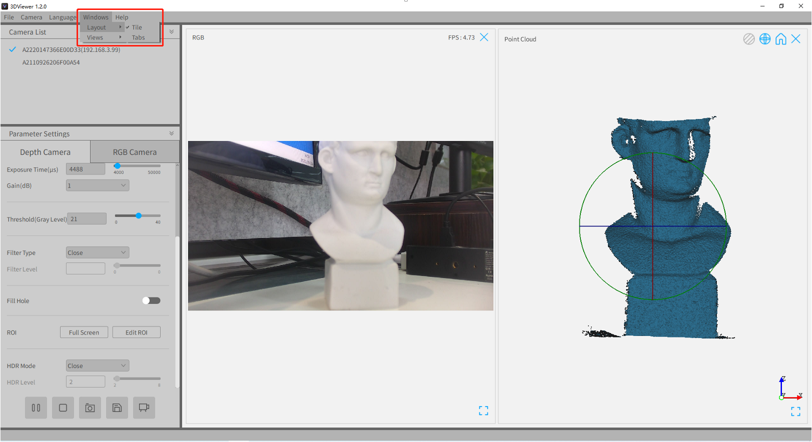 | 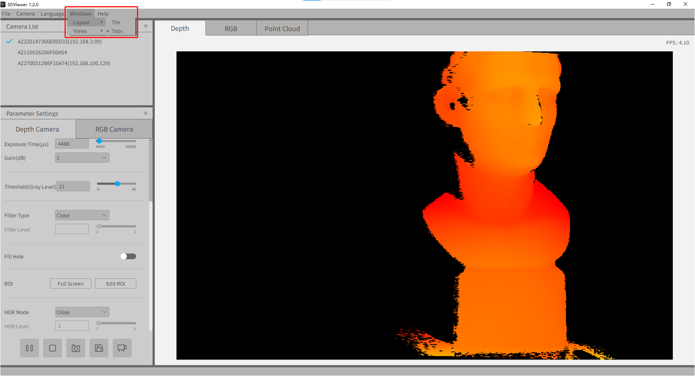 |
### Hide/Show Single Window

If a window image is not our concern, we can hide the window in two ways:
1. Under Tile display layout, click "✖" in the upper right corner of the image;
2. Click the "Windows" menu -->Views submenu, and click the window name to be hidden in the menu item.
The hidden window needs to be displayed again. Click the "Windows" menu -->Views submenu, and click the window name to be displayed in the menu item.
|Hide Window | Hide/Show Window|
| ----------------------------------------------- | --------------------------------- |
|  | 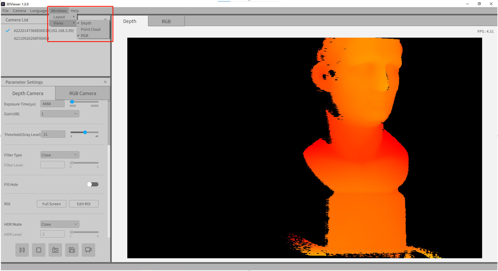 |
### Enter/Exit Full Screen

Entering/exiting the full screen only takes effect when the Tile display layout is displayed. If you feel that the image window displayed under the Tile layout is too small, as shown in the figure, click the full screen button at the lower right corner of the image, and only the image will be displayed in the image display area, while other windows will be hidden to facilitate the observation of image details; If you need to exit the full screen state, click the exit full screen button at the lower right corner of the full screen display image to restore the state before the full screen.
|Enter full screen | Exit full screen|
| -------------------------------------- | ------------------------------------------ |
| 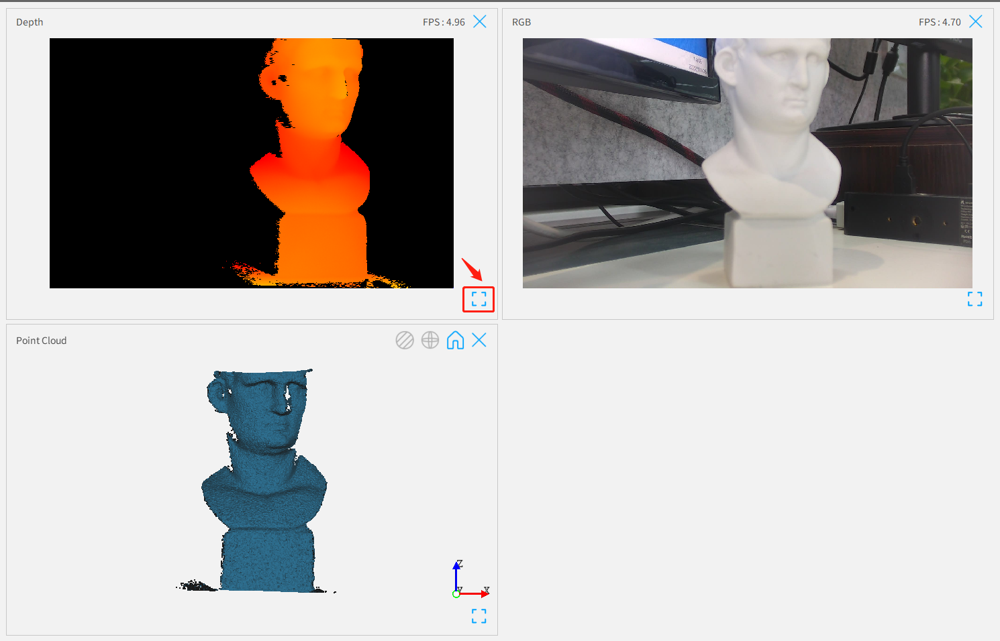 |  |
### 2D image display magnification

To view some details of the image, click the 2D image with the mouse, and then press and hold the Ctrl key while scrolling the mouse wheel to enlarge the image.
be careful:
1. This operation only takes effect in the 2D display window, and the point cloud does not take effect;
2. This operation takes effect only when the image is displayed in full screen under Tile display layout, and does not take effect when the image is not displayed in full screen.
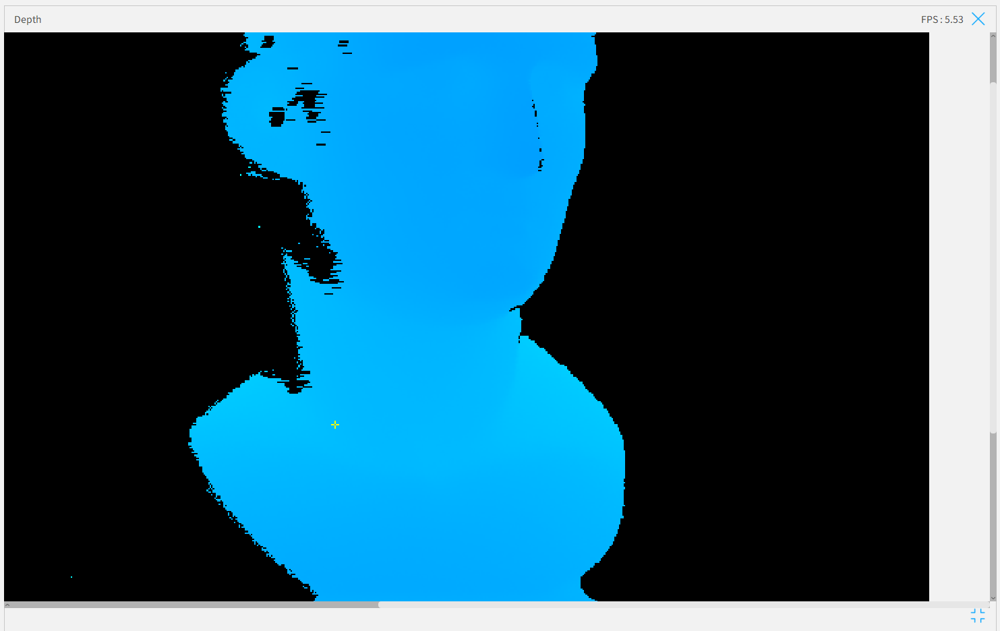
### Display point information in depth map

To view the point information on the depth map, just click the position on the depth map to be viewed with the left mouse button. As shown in the following figure, Depth Scale and XYZ coordinates of the current point will be displayed at the lower left corner mark 2.

### Point cloud display settings

#### Return

As shown in the following figure, click the homing button at the upper right corner of the point cloud display, and the point cloud image will return to its original position and state.

#### Hide/Show Textures

As shown in the following figure, if you want to view the point cloud with a map, you can click the Open Texture icon button in the upper right corner of the point cloud. If you do not want to display the map, click the button again to close the texture (note that if the device does not have an RGB camera, the point cloud image does not have a map, and the Open/Close Texture button is not displayed in the upper right corner of the point cloud window).
|Point Cloud without Map | Point Cloud with Map|
| -------------------------------------- | --------------------------------------------- |
|  | 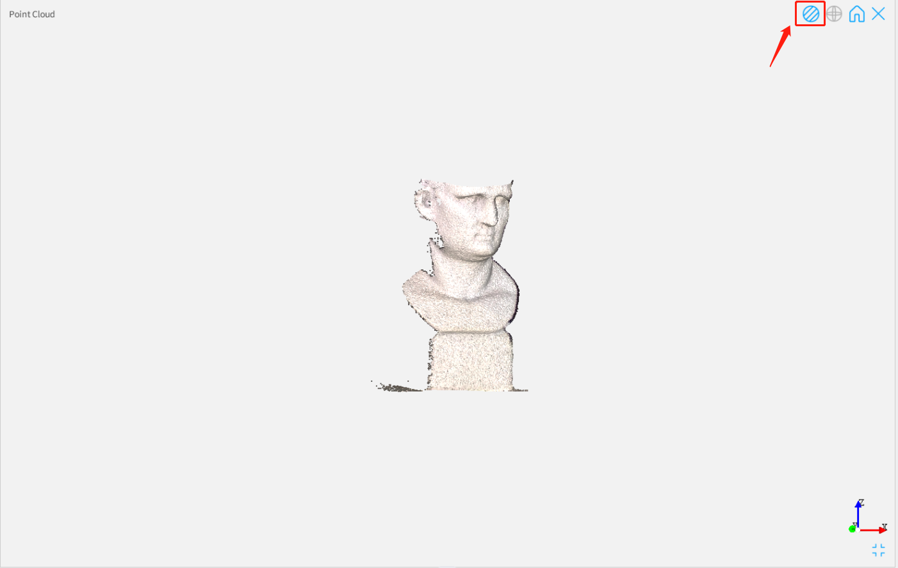 |
#### Hide/Show Trackball

The trackball marks the rotation center of the point cloud, as shown in the following figure. To hide/display the trackball, click the icon button at the upper right corner of the point cloud.
|Don't Show Trackball | Show Trackball|
| -------------------------------------- | ------------------------------------- |
|  |  |
## Single trigger

- **Enter the single shot mode**: As shown in the figure below, click the icon button marked 2. After entering the single shot mode, the bottom status bar prompts "Entered single shot mode! You can click the button to get the next frame".
- **Exit the single trigger mode**: As shown in Figure 2 below, after entering the single trigger mode, click the icon button marked with 2 to exit the single trigger mode and switch to the continuous outflow mode.
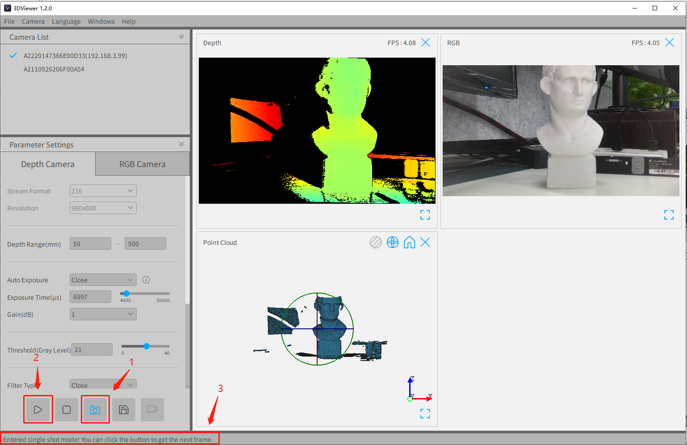
- **Acquire new frame data**: After entering the single trigger, you need to click the "Single Trigger" button again to acquire a new frame data.
  

## Collect data

### Single frame acquisition

- **Turn on/off automatic naming**: In the "Auto file Naming" submenu of the File menu, the following icon is marked with 2, and you can set on and off. If it is set as on, click single frame acquisition to automatically generate the file name; If it is off, click single frame acquisition to pop up the file saving box, and enter the name of the saved file.
- **Acquire a frame of data**: As shown in the following figure, click Mark 1 to save all current images and point cloud data.

### Multi frame acquisition

The multi frame acquisition function can save continuous multi frame data. In the Capture setting box, you can set Frame Number, Data Type, and Save Format. One frame of point cloud data exists Ply file; When Save Format is images, one frame of image data is stored as one png file. When the Save Format is raw, one frame of image data is stored as a. raw file. Finally, all files stored in multiple frames are packaged as a. zip compressed file. Multi frame acquisition operations are as follows:
1. Click the multi frame acquisition button marked as below;
2. Modify the relevant settings in the acquisition setting box of the following icon mark 2;
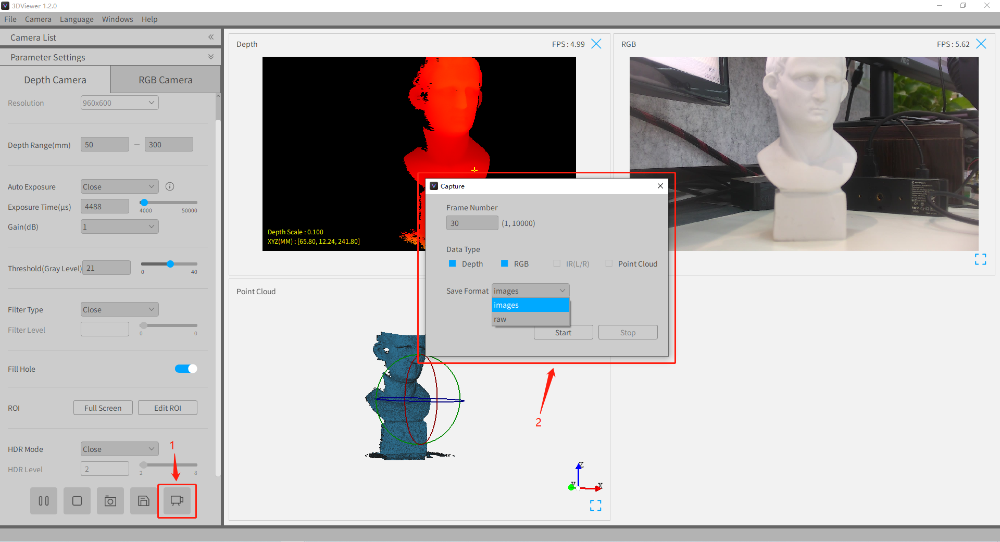
3. Click the "Start" button in the acquisition setting box, and then enter the saving name in the file saving box in the pop-up box;
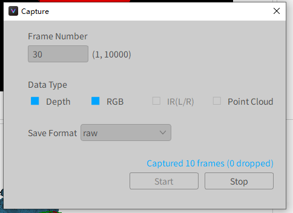
4. Wait for the acquisition to be completed, as shown in the figure below. The status bar at the lower left corner prompts that the number of frames collected is equal to the set number of frames, indicating that the acquisition is completed.

## Playback

The. zip data acquired from multiple frames can be played manually through 3DViewer. The operation steps are as follows:
1. Click the File menu -->Playback;

2. Select the captured . zip file

3. After successful import, the following pop-up box will pop up;
    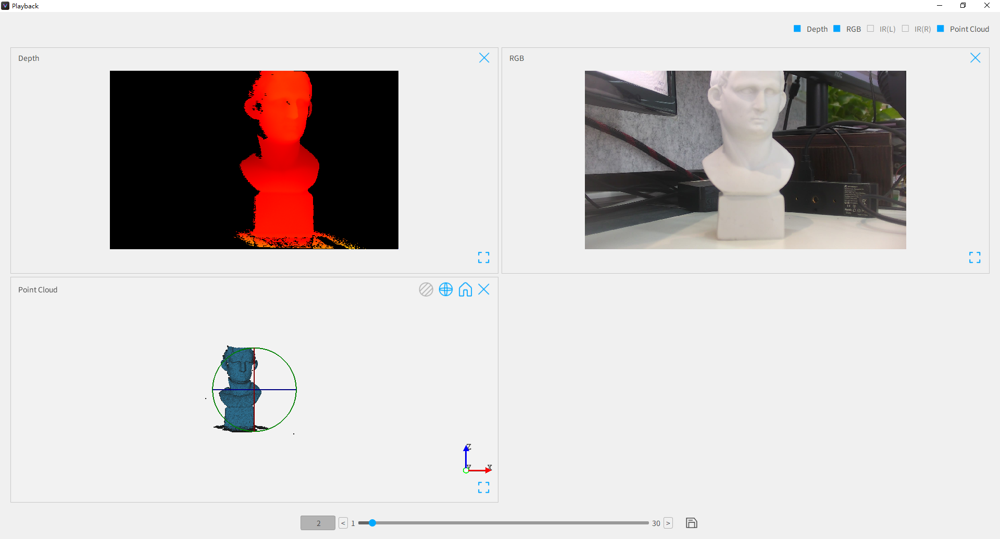
4. Switch the display window: the following icon is marked as 1, click the check box to switch the window to be displayed;
5. Manual playback: mark 2 with the following icon, and enter the frame number to be displayed in the input box or adjust the slider to adjust the frame to be displayed;
6. Save the current frame: the following icon is marked as 3. Click the Save button to save the currently displayed frame data.
    
## Convert depth data to point cloud data

For those saved in multi frame acquisition The zip data can be converted into point cloud data through the batch conversion function in 3DViewer. The specific operation steps are as follows:
1. Click the File menu -->Convert depth data to point cloud;
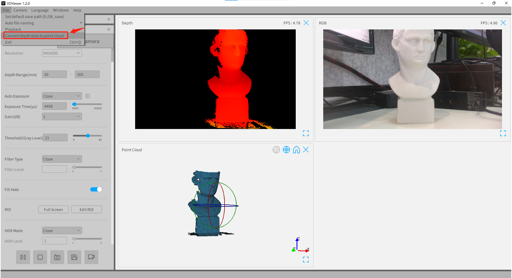
2. Click the "Browse" button on the right of "Select source file" to select the captured .zip file;
3. Click the "Browse" button on the right of "Select output directory" to select the conversion output directory;
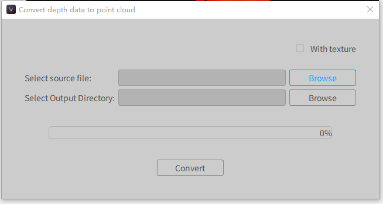
4. Click the "Convert" button to perform batch conversion;
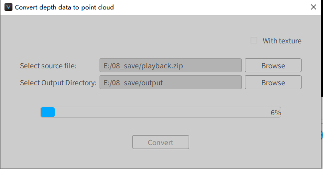
5. Wait until the conversion is completed, and the following prompt indicates that the conversion is completed.

## Switch languages

Click the "Language" menu, and then click the language to be switched (Currently only English and Chinese are supported).
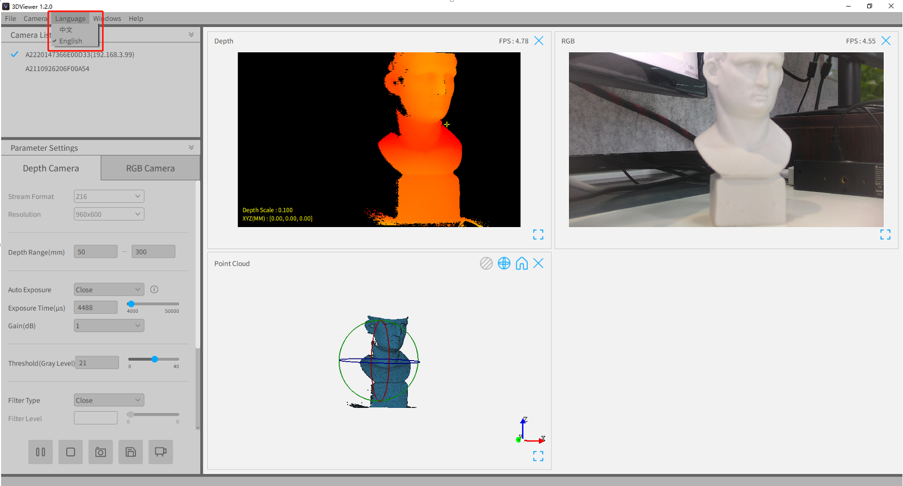

## Help

To learn more about the 3Dviewer, click the "Help" menu, which contains the following contents:
- **Manual**: Click this menu item to open the 3DViewer manual;
- **Github**: Click this menu item, and use the local browser to open the warehouse address of 3DViewer in Github;
- **Web Site**: Click this menu item to open the company's official website using the local browser;

- **Open log directory**: Click this menu item to open the 3DViewer log storage directory, as shown in the following figure, where sdk.log is the log of 3DCamera library; 3DViewer. xxxxx.log is the 3DViewer program log.
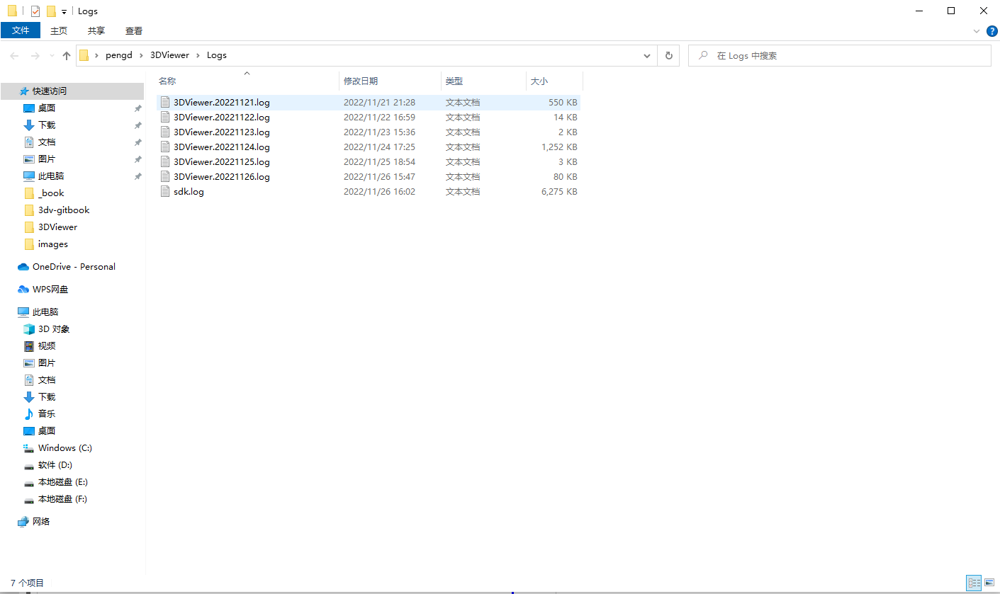

