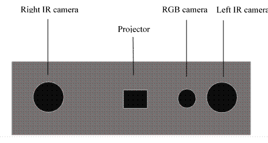

## Terms
- **3D camera** : a camera that can obtain 3D point clouds and RGB colors of objects, as shown below;

- **Depth Stream** : Depth value data stream collected by 3D camera;
- **RGB Stream** : Data stream collected by RGB color camera;
- **Z16 Stream** : 16 bit depth image output format. The depth information of each point on the image is represented by 16 bit unsigned integer. The depth value * Scale gets the distance in millimeters. Scale can be obtained from the device attribute;
- **Z16Y8Y8 Stream** : 16 bit depth image + left and right camera infrared image output format, 1 byte ~ 2  * width  * height byte is depth image,  (2  * width  * height + 1) byte ~ 3  * width  * height byte is left camera infrared image, (3  * width  * height + 1) byte ~ 4  * width  * height byte is right camera infrared image;
- **Pair Stream** : Infrared image output format of left and right cameras, 1byte ~ width  * height byte is infrared image of left camera,  (width  * height + 1) byte ~ 2  * width  * height byte is infrared image of right camera;
- **RGB8 Stream** : 24 bit RGB8 image output format;
- **MJPG Stream** : RGB camera MJPG image output format;
- **Point Cloud** : A collection of sampling points on the object surface. Each point has XYZ coordinates under the camera coordinate system;
- **FPS** : Frame Per Second, the number of frames output in one second;
- **Depth** : The distance from the measuring point to the XY plane of the camera coordinate system;
- **SDK** : Software Development Kit;
- **API** : SDK interface function;
- **Depth Range** : Depth visible range. Objects beyond the range depth will not be captured by the camera;
- **Exposure Time** : Exposure time refers to the time interval from shutter opening to shutter closing;
- **Gain** : Camera gain refers to the magnification of image brightness, and the greater the gain, the greater the brightness, and the greater the noise.
- **Smooth Filter** : Smooth filter is a spatial domain filtering technology with low-frequency enhancement;
- **Median Filter** : A nonlinear smoothing technique, which sets the gray value of each pixel as the median of the gray value of all pixels in a neighborhood window of the point;
- **ROI** : Region Of Interest. In machine vision and image processing, the area to be processed is delineated from the processed image in the form of box, circle, ellipse, irregular polygon, etc;
- **HDR** : High Dynamic Range;
- **Auto Exposure** : Auto exposure means that the camera automatically adjusts the exposure according to the intensity of light to prevent overexposure or underexposure;
- **Auto White Balance** : Automatic white balance is usually the default setting of digital cameras. There is a complex rectangular image in the camera, which can determine the white balance reference point in the picture to achieve white balance adjustment;
- **White Balance** : Its basic concept is "no matter under any light source, white objects can be restored to white". For the phenomenon of color deviation when shooting under a specific light source, it can be compensated by strengthening the corresponding complementary colors;
- **Depth Scale** : The scaling factor for converting the depth value in the depth flow into the actual distance (mm);
- **Soft Trigger** : The camera works in standby mode, and when the software is triggered (click a button, execute a script, or call the software interface), it can take pictures or perform other functions;
- **External Trigger** : The camera responds to the external input trigger signal to collect images, so as to achieve synchronization with other devices;